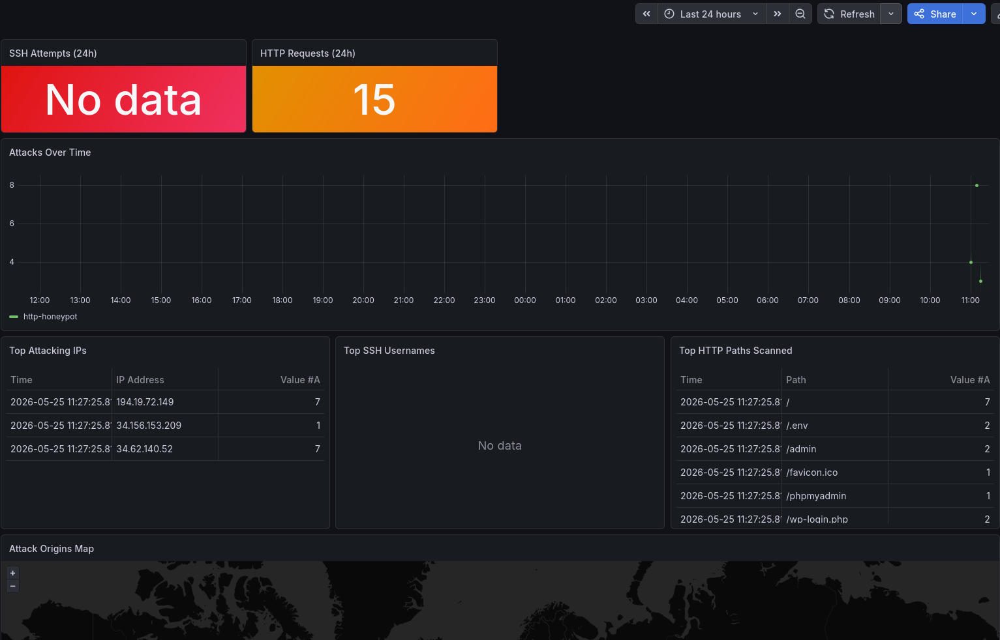

# Honeypot

A dockerized honeypot that monitors and logs real-world attack attempts on SSH and HTTP, with live visualization using Grafana.

Built by **Alberto Erbusti**



## What it does

Exposes two decoy services on a public VPS:

- **SSH (port 22)** — powered by [Cowrie](https://github.com/cowrie/cowrie), a medium-interaction honeypot. Accepts any login attempt, simulates a fake Linux shell, and logs every command and credential the attacker tries.
- **HTTP (port 80)** — a custom Python service that mimics a vulnerable web server. Returns convincing fake responses for common attack targets (`/.env`, `/wp-admin`, `/phpmyadmin`, etc.) and logs every request with IP geolocation data.

All logs are shipped through **Promtail → Loki** and visualized in a **Grafana** dashboard showing:
- Attack volume over time
- Top attacking IPs
- Most-tried SSH credentials
- Most-scanned HTTP paths
- Live world map of attack origins

## Stack

| Component | Role |
|---|---|
| Cowrie | SSH honeypot |
| Python / FastAPI | HTTP honeypot |
| Promtail | Log shipping |
| Loki | Log aggregation |
| Grafana | Visualization |
| Docker Compose | Orchestration |

## Architecture

```
┌─────────────────────────────────────────────────────┐
│                  Docker Compose                      │
│                                                      │
│  ┌─────────────┐    ┌──────────────────────────┐    │
│  │   Cowrie    │    │  Custom HTTP Honeypot     │    │
│  │  SSH :22    │    │     Python :80            │    │
│  └──────┬──────┘    └────────────┬─────────────┘    │
│         │ JSON logs              │ JSON logs         │
│         └──────────┬─────────────┘                  │
│                    ▼                                 │
│             ┌─────────────┐                          │
│             │   Promtail  │                          │
│             └──────┬──────┘                          │
│                    ▼                                 │
│               ┌────────┐                             │
│               │  Loki  │                             │
│               └────┬───┘                             │
│                    ▼                                 │
│              ┌─────────┐                             │
│              │ Grafana │                             │
│              └─────────┘                             │
└─────────────────────────────────────────────────────┘
```

## Setup

### Requirements
- A VPS with a public IP (Ubuntu 22.04 recommended)
- Docker and Docker Compose installed

### Deploy

```bash
git clone https://github.com/albierbi/honeypot.git
cd honeypot
cp .env.example .env
nano .env  # set your Grafana password
mkdir -p logs/cowrie logs/http
docker compose up -d
```

Grafana will be available at `http://YOUR_VPS_IP:3000`.

### Security notes

- Run this on a dedicated VPS, never on your personal machine
- Move your real SSH to a non-standard port before exposing port 22 to Cowrie
- The `.env` file contains credentials and is gitignored — never commit it
